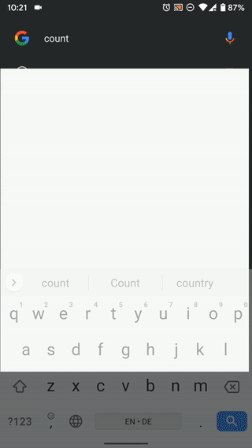

# Country Flags

### Introduction
Android app that pulls data from https://restcountries.eu/rest/v2/all.

### Used libraries
**Dagger2** - Dagger2 was used for dependency injection. 
**RxJava2** - RxJava2 was used for threading and data stream management. 
**Retrofit2** - Network calls 
**AndroidKtx** - For cool extensions to Android classes. 
**Architecture Components** - For Lifecycle in the presentation layer. 
**Mockito** - For mocking test dependencies. 
**JUnit** - For Unit test assertions etc. 
**Konveyor** - For generating random data for tests. 
**Espresso** - For UI testing. 

### Process

I decided to use clean architecture and also break down the project into modules, I thought of exploring `Kotlin Flows` extensively but decided otherwise because `RxJava2` is (as at the time of writing more mature for my chosen presentation architecture MVI), I also decided to use different models for each layer of the architecture so I could do some data cleaning and conversion to fit the models into each layer. I wrote interfaces to represent repositories in the domain layer and then wrote `UseCase`s for searching countries and fetching all countries and then wrote tests for the usecases and repositories.

Afterwards I started writing the `data` layer, here I began by writing models for each of the apps entities/data objects and then interfaces that described classes that would interact with the restcountries API e.g ICountriesRemote. I then wrote concrete implementations of all the repositories defined in the `domain` layer with tests.

Finally I started work on the UI layer. I used the MVI architecture supported by `ViewModel` and `RxJava2`. I tested only the ViewModel classes and wrote a small navigation wrapper around the `FragmentManager` API to switch between destinations in the application and used Dagger2 to provide dependencies to the fragments and ViewModels.

### Possible Improvements

I had a lot of fun building this. There are some improvements I intend to make.

- Write more tests for UI.  
- Use MockWebServer to test `Remote` layer API calls. 
- Improve UI and add a bookmarking feature (just because I can 🙂). 
- Write more Unit tests.

### Build Instructions
- Clone repository. 
- Run with Android Studio 4.0 canary 3 and above.  
